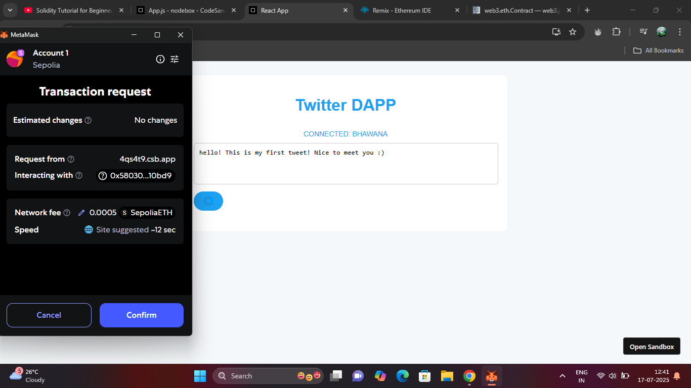
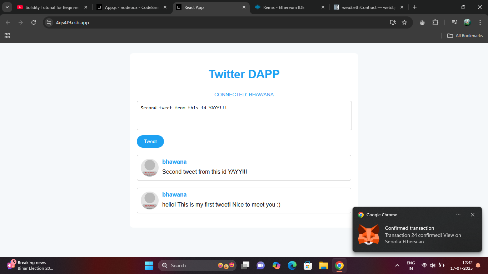
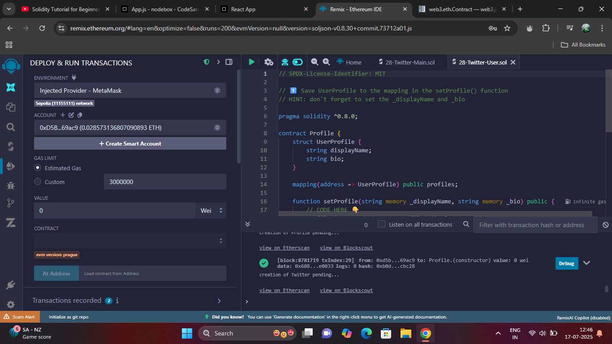
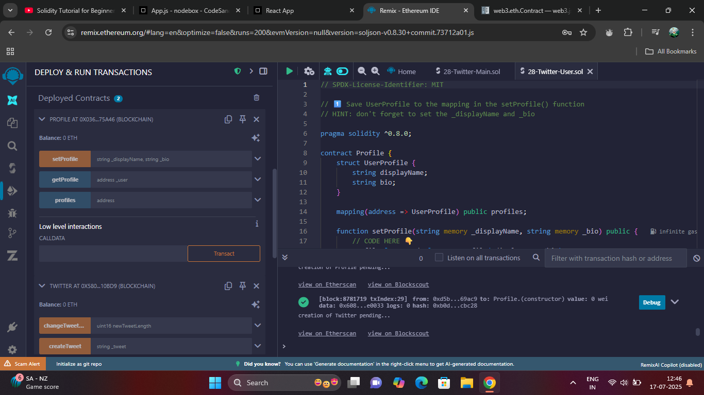

# react-twitterDApp
# Twitter DApp (Decentralized Twitter Clone)

A decentralized Twitter clone built with **React.js** and **Solidity**, running on the **Sepolia Ethereum Test Network**. Users can register, connect their MetaMask wallet, create a profile, tweet, like/unlike tweets — all via interactions with smart contracts deployed from **Remix IDE**.

Features
- Connect MetaMask wallet
- Create and manage a user profile
- Post tweets stored on the blockchain
- Like and unlike tweets
- Interact with deployed smart contracts on Sepolia network

---
##  Tech Stack

- **Frontend**: React.js, JavaScript, CSS
- **Blockchain**: Solidity, Ethereum (Sepolia Testnet), Remix IDE
- **Wallet Integration**: MetaMask
- **Web3 Libraries**: ethers.js

